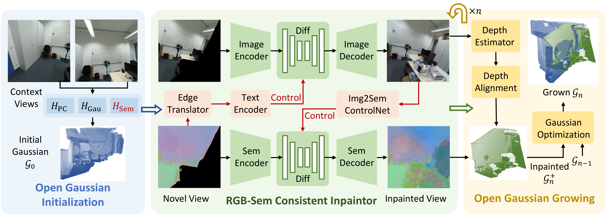

# OGGSplat: Open Gaussian Growing for Generalizable Reconstruction with Expanded Field-of-View

### [Paper](https://arxiv.org/pdf/2506.05204)  | [Project Page](https://yanbo-23.github.io/OGGSplat/)  | [Code](https://github.com/Yanbo-23/OGGSplat) 
> Official codebase for **OGGSplat**, presented in the paper:
> **OGGSplat: Open Gaussian Growing for Generalizable Reconstruction with Expanded Field-of-View**

Created by [Yanbo Wang*](https://Yanbo-23.github.io/), [Ziyi Wang*](https://wangzy22.github.io/), [Wenzhao Zheng](https://wzzheng.net/), [Jie Zhou](https://scholar.google.com/citations?user=6a79aPwAAAAJ&hl=en&authuser=1), [Jiwen Lu†](https://scholar.google.com/citations?user=TN8uDQoAAAAJ&hl=zh-CN).


## 🧠 Overview



**OGGSplat** is a novel generalizable 3D reconstruction framework that extends the field-of-view from sparse input images by leveraging semantic priors. It introduces an **Open Gaussian Growing** approach that combines RGB-semantic joint inpainting guided by bidirectional diffusion models to extrapolate unseen regions beyond the input views. The inpainted images are then lifted back into 3D space for progressive optimization of Gaussian parameters, enabling efficient and high-quality semantic-aware scene reconstruction. 


## ✅ TO DO List

- [x] **Release Checkpoints**  
  Publicly release all pretrained model checkpoints.

- [x] **Inference Code**  
  Provide inference scripts to perform scene extrapolation from sparse input views (scannet++) using pretrained models.

- [ ] **Evaluation Benchmark**  
  Release the **Gaussian Outpainting (GO)** benchmark suite, including quantitative metrics for semantic consistency and visual plausibility.

- [ ] **Demo Code**  
  Provide demo scripts to perform scene extrapolation from any 2 input views.

- [ ] **Training Code**  
  Provide the full training pipeline, covering Gaussian initialization, diffusion-based inpainting, and progressive optimization procedures.

## 📦 Installation

- Please refer to [installation.md](installation.md) for detailed instructions on setting up the environment and installing all required dependencies for training and evaluation.
- To enable training and inference, pre-trained APE text/image encoder weights are required. For convenience, we provide the pre-trained weights here: [📥 APE Weights](https://drive.google.com/file/d/1748HfCd9w8D-PeyKdHrDpWNvvMhdWUlC/view?usp=sharing).

## 📚 Datasets
Our training and inference are based on the **ScanNet++** dataset. We download the raw data from the [official ScanNet++ homepage](https://kaldir.vc.in.tum.de/scannetpp/) and preprocess it using a customized version of the [ScanNet++ toolkit](https://github.com/Nik-V9/scannetpp) provided by **SplaTAM**.


## 📂 Model Checkpoints

| **Model Name**      |**Function Description**                      | **Download Link**                                                                 |
|---------------------|--------------------------------------------------------------|------------------------------------------------------------------------------------|
| **Autoencoder**     | Encode or decode APE features to adjust their dimensions     | [📥 Google Drive](https://drive.google.com/file/d/1axK5lEkgPbAPiUE7wFTjbr8KNcljQKgP/view?usp=sharing) |
| **Gaussian Init.**  | Initialize Gaussians with semantic-aware feature embeddings  | [📥 Google Drive](https://drive.google.com/file/d/1q6p25VTzo28o81tt9slE-R2a0FowUILO/view?usp=sharing) |
| **RGB UNet**        | Denoising module for RGB image inpainting tasks              | [📥 Google Drive](https://drive.google.com/file/d/1oLvIus3milgq184Uw1n9KanWcoZkz5zM/view?usp=sharing) |
| **Sem. VAE**        | Variational autoencoder for semantic feature representation  | [📥 Google Drive](https://drive.google.com/file/d/1H49yuTtsg9KHg7G-pz__VRjOXg2iFagZ/view?usp=sharing) |
| **Sem. UNet**       | Denoising module for semantic map inpainting tasks           | [📥 Google Drive](https://drive.google.com/file/d/1FkGsh6di4cb46k_9EnagM03PANcsDEKk/view?usp=sharing) |
| **ControlNet**      | Control module to guide semantic generation using RGB conditions | [📥 Google Drive](https://drive.google.com/file/d/1UdUY541leQXi4pnIxh0tV9_BuwurnmMW/view?usp=sharing) |


## 🚀 Inference for Scannet++
This section provides instructions to perform Gaussian growing inference on the ScanNet++ dataset using our pre-trained model. Before proceeding, please ensure that you have downloaded the dataset and the corresponding checkpoint files.

You need to specify the dataset path and checkpoint locations in the configuration file `configs/oggsplat_infer.yml`. Additionally, you can customize the input by editing the `select_frames` parameter to choose any two context views as input.

Once the configuration is set, run the following command to start the Gaussian growing process:

```bash
python gaussian_growing.py --seed <seed_value> --config <path_to_config_file>
```
## 📄 Citation

If you find our work helpful, please consider citing:

```bibtex
@article{your2025oggsplat,
  title={OGGSplat: Open Gaussian Growing for Generalizable Reconstruction with Expanded Field-of-View},
  author={Your Name and Co-authors},
  journal={arXiv preprint arXiv:xxxx.xxxxx},
  year={2025}
}
```

